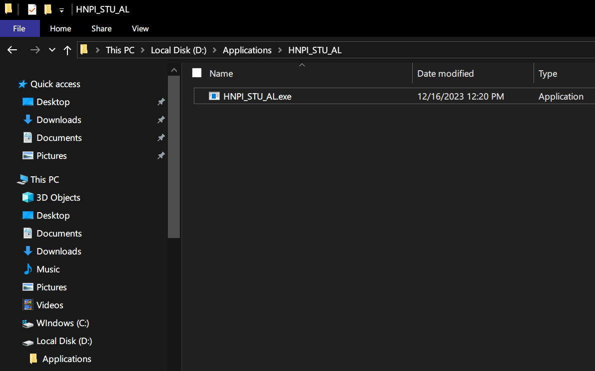
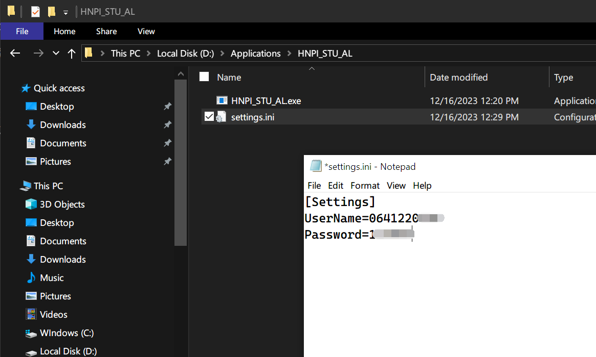
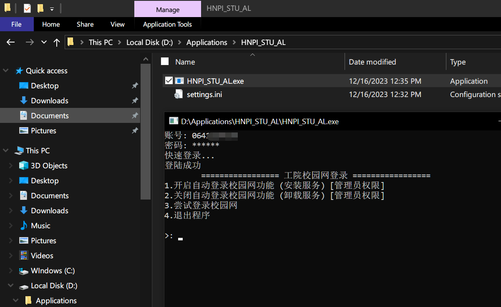
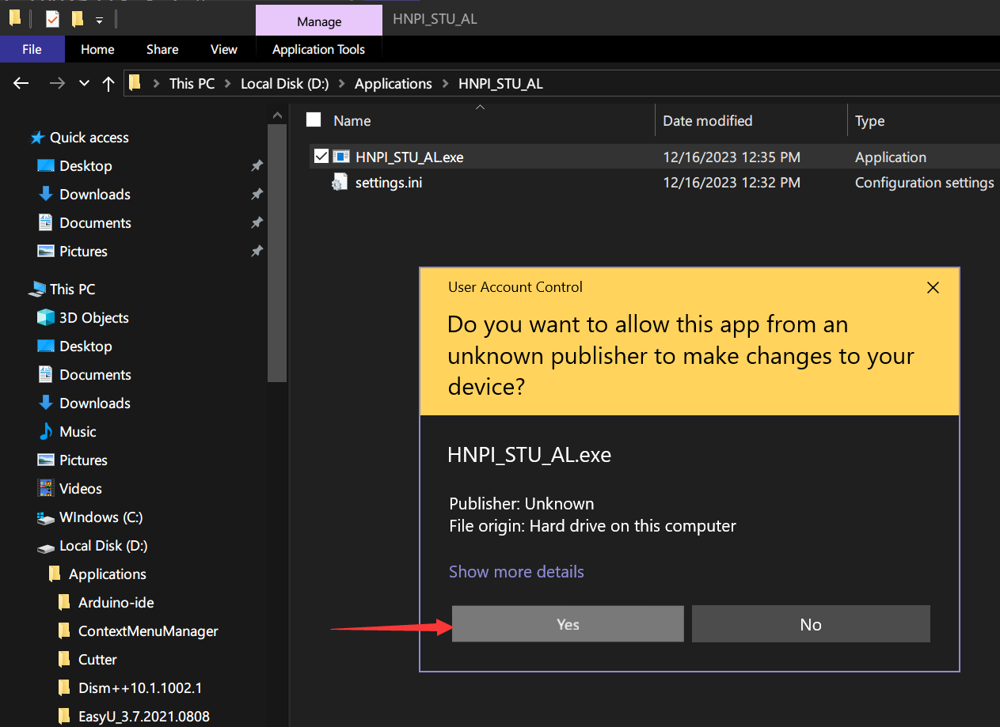
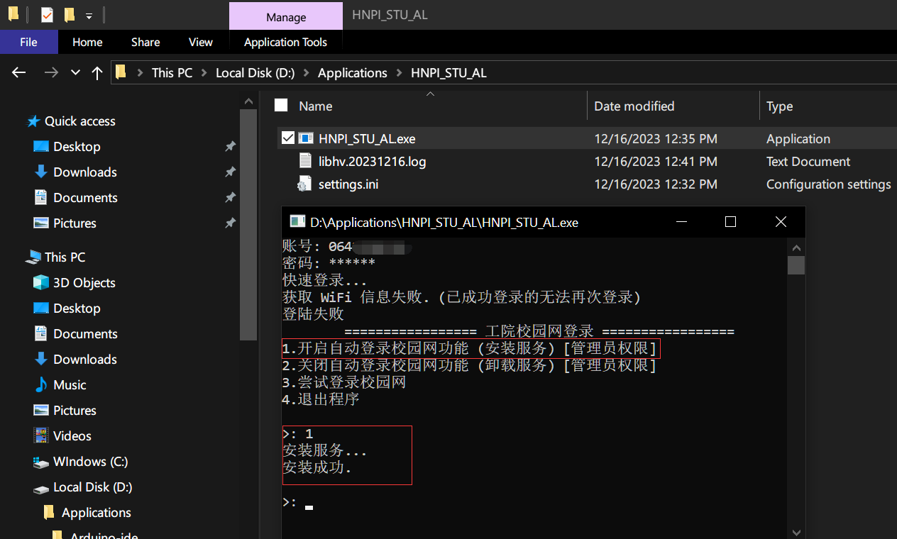
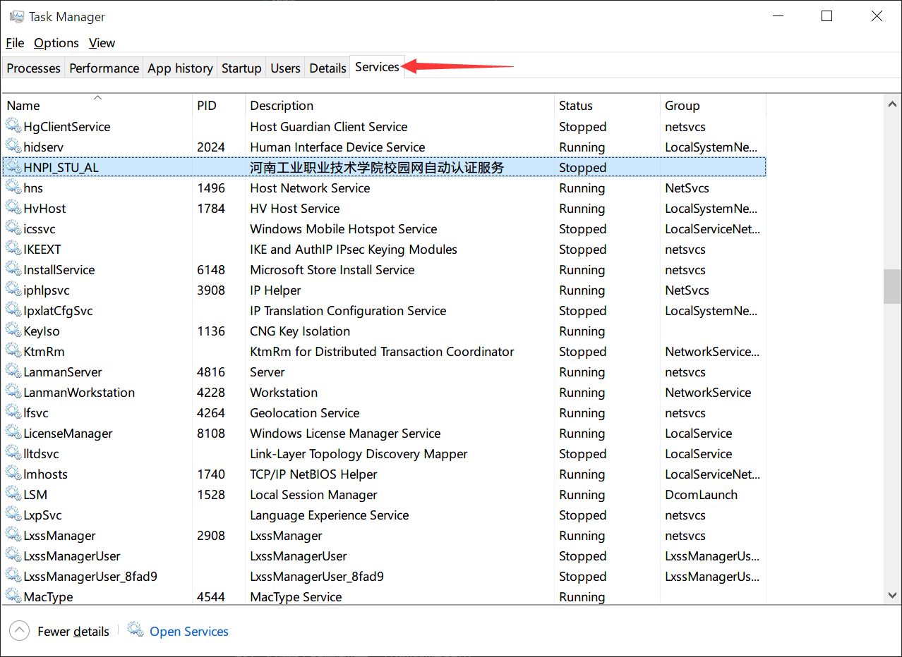
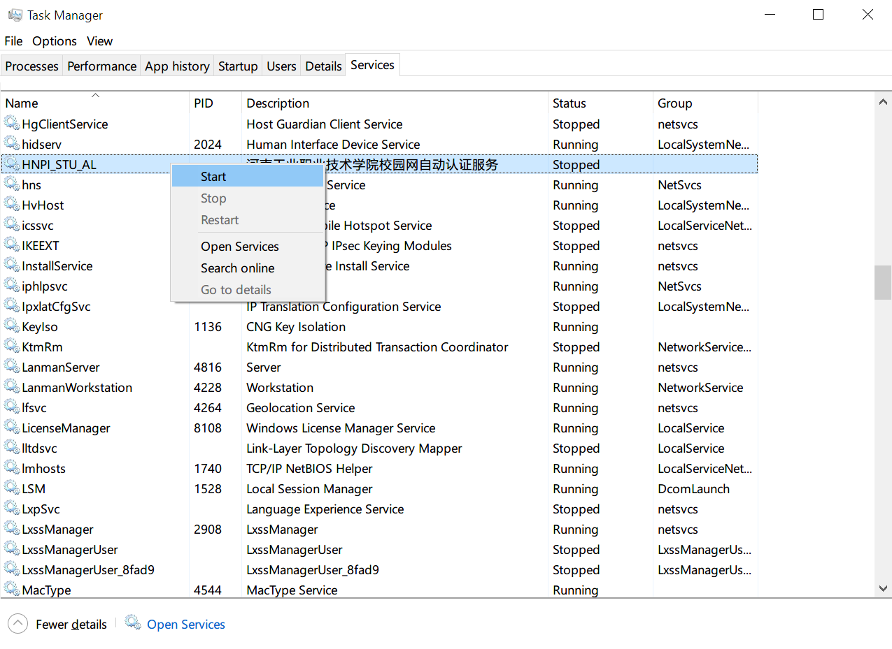
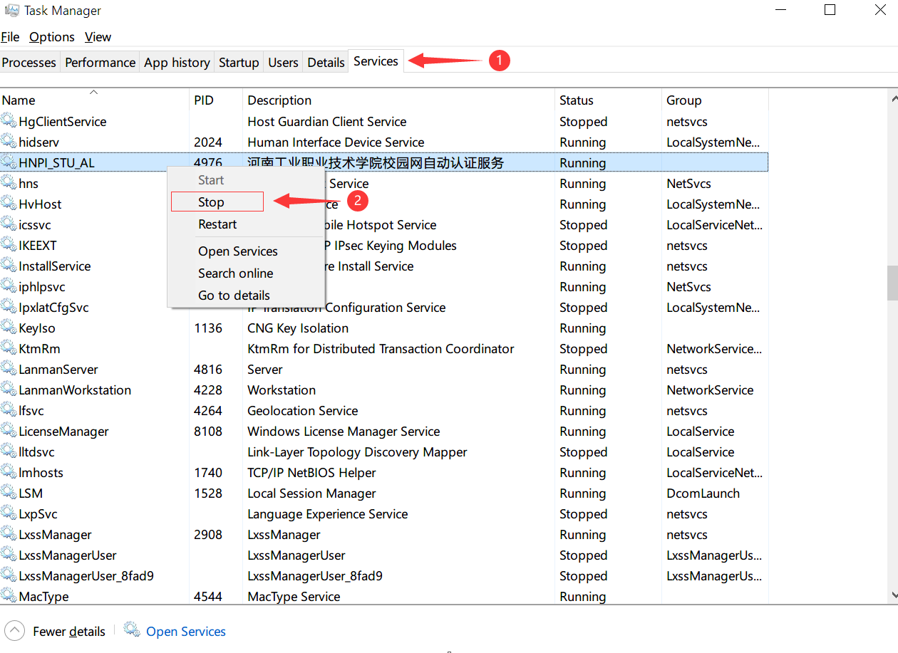
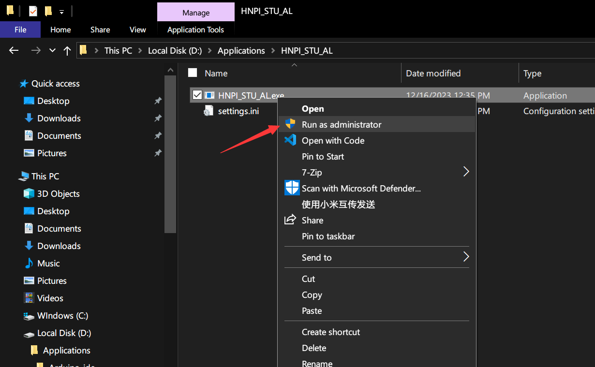
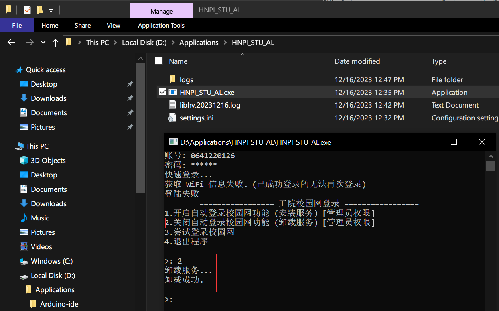

# 河南工院校园网自动登录服务

## 基本使用

进入 [Release](https://github.com/AmzGrainRain/HNPI_STU-AutoLogin/releases) 页面下载 HNPI_STU_AL.exe 并将其保存到一个合适的目录：

双击打开 HNPI_STU_AL.exe：

按任意键或者关闭程序，打开当前目录下的 settings.ini 文件，把你的校园网账号密码填入之后保存并关闭文件：

再次双击打开 HNPI_STU_AL.exe：

## 注册为服务

将此程序注册为服务后，可以实现后台检测网络状态变更后自动登录的功能（可能会有延迟）。

要开启此功能请右键程序以管理员身份运行：

然后输入 2 按回车即可安装服务：

然后打开任务管理器，切换到服务页，找到 HNPI_STU_AL 服务：

右键点击启动服务：

## 卸载服务

打开任务管理器，切换到服务页，找到 HNPI_STU_AL 服务右键点击停止：

然后右键程序以管理员身份运行：

然后输入 2 卸载服务：

## 编译

开发此项目时仅考虑了 Windows 平台。如果想移植为 linux 平台，需要编写新的 service_manager.hpp 以及修改所有代码中使用的 Windows API 由于时间有限我就作罢了，理解万岁哈。

编译器：MSVC

语言级别：C++20、C17

源码文件编码：GBK，CodePage 936

编译时不要开启 windows 的 unicode utf-8 字符集支持，此举将导致没有开启 unicode utf-8 字符集支持的 windows 运行此程序时中文乱码。

服务启动后，您可以在程序所在的目录下看到一个 logs 目录，那是服务运行时产生的日志目录，里面会显示一些必要的信息，如果您需要反馈 bug，请连带目录内部的日志一同上传。

## 开源协议

[MIT](https://opensource.org/licenses/MIT)
